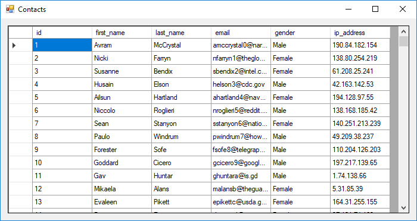

DataGridView Class
==================

Displays data in a customizable grid.

Usage
-----

### Populating

Populating a DataGridView control can be done in a few different ways. The common way would be to do a complex data bind. When a DataGridView is data bound, the DataGridView will automatically determine the columns, rows and data it displays.

{:.img-responsive}

### Row Header

When enabled, the Row Header column will display visual information about rows in the DataGridView. A Row Header, containing an arrowhead (), indicates a cell in that column is currently selected. A Row Header containing an asterisk ('\*') indicates the row is to be used to add new rows to the DataGridView.

A cell in the Row Header can be clicked to select the entire row.

### Editing Data

To edit data in a cell of a DataGridView, perform one of the following:

*   Press the <kbd>F2</kbd> key.
*   Type while a cell is selected.
*   Double-click the cell.

When a cell is being edited (edit mode), the underlying data source is not being changed. The cell must exit edit mode, to apply the change to the underlying data source.

To exit edit mode, one of the following things must happen:

*   User presses the <kbd>Tab</kbd> key.
*   User clicks another cell.
*   A call to the DataGridView's `EndEdit()` method.

### Notable Class Members

**Properties**

*   CurrentCell
*   CurrentRow
*   DataSource
*   IsNewRow
*   Rows
*   Selected
*   SelectedRows
 
**Methods**

*   EndEdit()
 
**Events**

*   CellValueChanged
*   RowsAdded
*   RowsRemoved
*   SelectionChanged

<a href="https://docs.microsoft.com/en-us/dotnet/api/system.windows.forms.datagridview?view=netframework-4.8" target="_blank">MSDN Documentation</a>